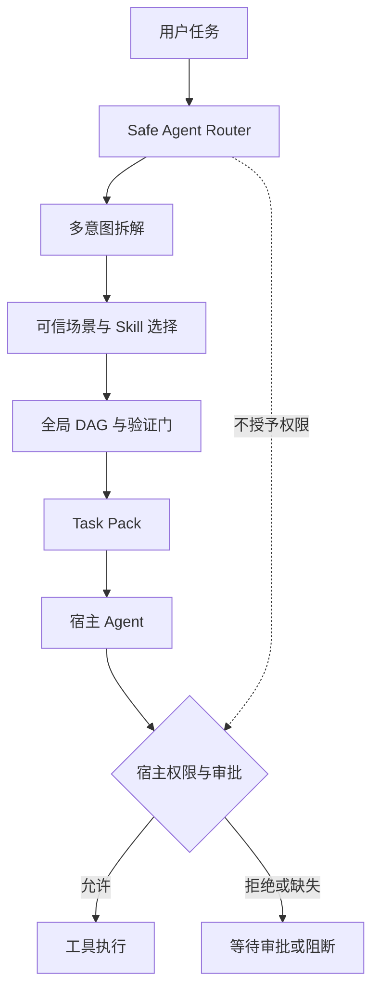
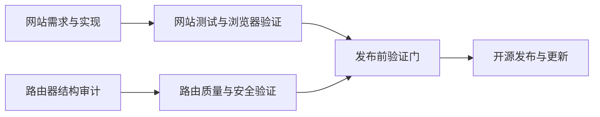

# 社区 Skill 太多、太乱、还不安全？只安装一个可信路由 Skill 就够了

> 只需安装一个安全路由入口，就能根据任务自动选择、组合可信 Skill，并生成可验证的执行方案。

**30 秒理解这个项目：**你不再需要从社区里逐个挑选、检查和搭配
Skill。安装 `safe-agent-router` 作为统一入口，直接描述任务；它会从经过
治理的可信目录中选择方法、组合工作流并生成执行图，再交给宿主 Agent
按自身权限执行。

AI Agent 的 Skill 生态正在快速扩张。

今天，你可以为 Agent 安装网页开发 Skill、代码审查 Skill、浏览器自动化 Skill、SEO Skill、PDF Skill、邮件 Skill、发布 Skill，甚至可以找到几十种功能相近但实现方式完全不同的版本。

这看起来意味着 Agent 越来越强。

但真正使用一段时间后，很多人会遇到另一组问题：

- 我应该为自己的场景安装哪些 Skill？
- 同类 Skill 有十几个，哪一个更可靠？
- 社区 Skill 里的命令安全吗？
- Skill 会不会要求读取密钥、执行 Shell，或者绕过权限限制？
- 一个任务需要多个 Skill 时，应该先用哪个、后用哪个？
- 两个 Skill 的能力重叠时，应该保留谁？
- 执行结束后，谁来负责测试、验证和发布检查？
- 安装的 Skill 越来越多，会不会让 Agent 的上下文越来越混乱？

用户真正想完成的事情可能很简单：

> 帮我构建一个官网，检查代码和 Skill 路由质量，验证通过后发布。

但在传统 Skill 使用方式下，用户往往需要先成为半个 Skill 专家。

这正是我们开发 **Safe-Agent-Skills** 和 **Hybrid Router v2** 的原因。

我们不希望用户先学习整个 Skill 市场，再手动安装和搭配几十个 Skill。我们希望用户只保留一个可信入口，然后直接描述自己想完成什么。

路由器负责回答三个问题：

1. 这个任务实际上包含哪些意图？
2. 应该选择哪些可信 Skill 和场景工作流？
3. 它们应该以什么顺序执行，在哪里验证，哪些动作需要宿主批准？

## 一、Skill 越多，Agent 不一定越可靠

很多 Agent 系统仍采用一种非常直接的扩展方式：需要什么能力，就安装一个 Skill。

如果任务比较复杂，就继续安装更多 Skill。

```text
需要开发网页        → 安装网页开发 Skill
需要设计界面        → 安装 UI Skill
需要浏览器验证      → 安装 Playwright Skill
需要 SEO            → 安装 SEO Skill
需要安全检查        → 安装安全审计 Skill
需要发布            → 安装部署 Skill
```

这种方式在 Skill 数量较少时还能工作。当 Skill 数量增加以后，问题会从“缺少能力”转变为“能力治理失控”。

### 1. 用户很难判断应该安装什么

用户通常知道自己的业务目标，却不知道目标应该映射到哪些技术能力。

“建设一个产品官网”背后可能同时需要：

- 需求整理；
- 页面结构设计；
- 视觉一致性；
- 响应式实现；
- SEO 内容；
- 浏览器截图验证；
- 构建检查；
- 发布检查。

要求普通用户自己发现并组合这些 Skill，本身就是一种额外负担。

### 2. 社区 Skill 不等于可信 Skill

一个 Skill 受欢迎、Star 很多，不能自动证明它适合进入受控 Agent 环境。

社区 Skill 中可能出现：

- `curl | bash` 一类远程下载执行；
- 未限制的 Shell 或解释器调用；
- 读取环境变量、Token 或密钥的指令；
- 要求绕过沙箱或审批流程；
- 对整个文件系统的宽泛访问；
- 将工具权限当作 Skill 自身权限；
- 含糊不清的来源、许可证或版本信息。

即使 Skill 没有恶意，它也可能不适合你的宿主环境。

### 3. Skill 之间会重复、冲突和相互覆盖

多个 Skill 可能都声称自己可以“审查代码”“优化 UI”或“完成发布”。

如果把它们全部塞进 Agent 上下文，可能出现：

- 重复执行相同检查；
- 对同一问题给出不同流程；
- 一个 Skill 要求先发布，另一个要求先审计；
- 验证步骤被实现步骤覆盖；
- 上下文不断膨胀，真正重要的边界反而被稀释。

### 4. 找到 Skill 不等于完成编排

即使已经选对 Skill，复杂任务仍然存在依赖关系。

例如：

```text
构建网站 ──┐
            ├─→ 验证通过 ─→ 发布
审计路由器 ─┘
```

发布不能只等待网站构建完成，也不能只等待路由审计完成。它必须同时依赖两条工作流的验证结果。

这已经不是简单的关键词匹配问题，而是一个工作流编译问题。

## 二、传统方式：安装、检查、组合，全靠用户自己

如果完全依赖人工，用户通常要经历这样的流程：


这条链路的问题在于，真正需要完成业务任务的人，被迫承担了 Skill 发现、供应链审查、能力建模和工作流编排四种额外角色。

我们希望把这条链路收敛成：


用户不再需要先回答“我要安装哪十个 Skill”。

用户只需要回答：“我想完成什么？”

## 三、一个可信入口，不是一个万能执行器

Safe-Agent-Skills 提供的核心入口是：

```text
safe-agent-router
```

它的职责不是亲自完成所有操作，而是成为 Skill 生态的统一选择和编排入口。

更准确地说，它是一个：

> **可信 Skill 选择器 + 场景工作流组合器 + 执行计划编译器。**

当用户提交任务后，路由器会：

1. 解析当前任务与相关上下文；
2. 将复合任务拆解成多个意图；
3. 从可信场景目录中检索候选工作流；
4. 过滤非可信 Skill 和无效引用；
5. 组合多个场景；
6. 生成全局依赖 DAG；
7. 添加验证门、完成门和审批标记；
8. 输出给 Codex、Claude Code 或其他宿主 Agent 使用的 Task Pack。

它不会因为选中了某个 Skill，就自动获得 Shell、网络、浏览器、账号或发布权限。

这些权限始终属于宿主运行时。



因此，“只安装一个 Skill”真正代表的是：

> 只安装一个可信入口，不再手工维护大量零散社区 Skill；具体方法由路由器按任务从可信目录中选择，具体执行仍由宿主控制。

## 四、可信从哪里来：先治理 Skill 供应链，再讨论自动选择

如果路由器只是从未经治理的社区 Skill 中随机挑选，那么“自动选择”反而会放大风险。

Safe-Agent-Skills 的第一层能力不是智能路由，而是 Skill 供应链治理。

### 1. 记录来源，而不是只复制内容

每个进入目录的 Skill 都需要尽可能记录：

- 来源类型；
- 来源地址或本地路径；
- 作者或所有者；
- 许可证；
- 来源提交；
- 文件清单；
- 内容哈希；
- 导入时间；
- Skill 与来源之间是导入、参考还是本地创作关系。

缺失的信息会被明确记录为未知，而不是直接省略。

### 2. 在信任之前进行风险扫描

系统会对 Skill 内容进行确定性的预检，识别包括但不限于：

- 破坏性 Shell 命令；
- 混淆后的远程执行；
- 下载后立即执行；
- 密钥或 Token 形态字符串；
- 环境变量和凭据外传；
- 权限提升与策略绕过；
- 未限制的文件系统访问。

扫描结果是审计证据，不只是一个提示框。

### 3. 将方法与执行权限分离

社区 Skill 里有价值的部分通常是方法：

- 什么时候使用；
- 需要什么输入；
- 应该按什么流程处理；
- 应该输出什么；
- 如何验证结果。

危险部分往往是把这些方法与直接执行命令、扩大权限或绕过策略绑定在一起。

Safe-Agent-Skills 会保留方法，移除或隔离不应由 Skill 决定的执行权限。

### 4. 默认只路由到 `trusted` Skill

目录中的 Skill 有明确状态。正常任务默认只使用可信 Skill。

来源不完整、分类不确定、内容存在风险或仍需人工确认的 Skill，不会因为关键词匹配成功就自动进入执行计划。

这是一种失败关闭策略：

> 宁可报告能力缺失，也不使用一个无法证明可信的 Skill 顶替。

## 五、路由器如何理解一个真实复合任务

我们使用下面这条任务作为 Hybrid Router v2 的强制验收案例：

```text
构建官网，同时审计 skill 路由器，验证通过后发布更新
```

这句话至少包含三个不同意图：

1. 构建官网；
2. 审计 Skill 路由器；
3. 在前面的工作验证通过后发布更新。

Hybrid Router v2 最终选择了三个可信场景：

- `website-build-launch`
- `skill-router-quality-review`
- `open-source-release`

随后，它将这些场景编译为一个全局执行图：

- 30 个节点；
- 31 条依赖边；
- 图状态为 `ready`；
- 图结构无环；
- 7 个节点被标记为需要宿主动作或审批。

可以把简化后的结构理解为：



发布工作流同时依赖网站路径和路由审计路径。

这说明系统做的不是：

```text
看到“官网” → 找一个网页 Skill
```

而是：

```text
识别多个意图
→ 为每个意图选择可信场景
→ 合并场景中的 Skill
→ 建立跨场景依赖
→ 插入验证与完成门
→ 标记需要宿主权限的节点
→ 输出统一 Task Pack
```

## 六、Contract v2：让 Skill 不只是自然语言说明书

仅靠一份自由格式的 `SKILL.md`，很难可靠完成自动编排。

Hybrid Router v2 引入了结构化 Contract，用于描述 Skill 的关键编排属性，例如：

- `stage_hint`：Skill 适合处于哪个阶段；
- `capability_vector`：Skill 提供哪些能力；
- `requires_context`：需要哪些上下文；
- `produces_artifacts`：会产生哪些交付物；
- `produces_evidence`：会产生哪些验证证据；
- `requires_after`：依赖哪些前置 Skill；
- `conflicts_with`：与哪些 Skill 冲突；
- `approval_classes`：涉及哪些宿主审批类型；
- `retry_policy`：重试应如何由宿主决定。

这让路由器可以区分：

- 一个 Skill 是负责规划、执行、审查还是验证；
- 哪些能力是强制的；
- 哪些步骤不能提前执行；
- 哪些动作涉及 Shell、网络、浏览器或发布权限；
- 某个任务包是否缺少必要能力。

需要注意的是，Contract 仍然不会授予权限。

例如，`approval_classes` 包含 `shell_execution`，只意味着宿主应该将节点视为需要审批的动作，而不是允许 Skill 自己执行 Shell。

## 七、为什么选择确定性路由，而不是一开始就全部交给 LLM

Hybrid Router v2 当前采用确定性路由，而不是让大模型自由决定所有 Skill 和依赖。

这样做有几个原因。

### 1. 结果更容易复现

相同任务、相同目录和相同配置，应尽量得到相同的意图、场景和执行图。

系统会为关键路由输入生成经过敏感信息清理的稳定 `route_id`，便于审计和比较。

### 2. 决策过程更容易解释

候选场景、选择结果、缺失能力、阻断原因和图依赖都可以被结构化输出。

### 3. 安全边界更容易证明

确定性规则可以明确保证：

- 只选择可信场景；
- 不引用未知 Skill；
- 缺少强制能力时报告不完整；
- 出现循环依赖时阻断；
- 输入资产异常时返回受控错误。

### 4. 为未来语义 Provider 保留可回退基线

未来可以增加语义 Provider，用于处理更复杂的同义表达、模糊需求和候选重排。

但语义能力应该是可选增强，而不是安全边界本身。

即使语义 Provider 不可用、输出非法或不满足隐私策略，系统仍应回退到确定性路径。

## 八、它现在做到了什么：工程验证数据

在第一阶段收尾时，我们在合并后的 `main` 分支重新运行了完整验证。

### 工程验证

- Ruff 检查通过；
- `scripts/verify.sh` 通过；
- 321 项单元与集成测试通过，0 失败；
- 独立最终代码审查为 0 Critical、0 Important；
- 强制复合任务可以生成就绪、无环的全局 DAG；
- 配置错误、空任务和结构异常资产可以通过 JSON 或 Markdown 返回受控错误。

### Contract 覆盖

强制复合任务所涉及的三个场景中，Contract v2 覆盖为 24/26，即 `92.31%`，高于 `80%` 门槛。

八个核心场景的持久化基线为 39/48，即 `81.25%`。

### 100 案例评估

项目包含一套 100 案例的多意图评估集。当前结果如下：

| 指标 | 当前结果 | 目标 | 判断 |
| --- | ---: | ---: | --- |
| 多意图完全匹配率 | 0.85 | 0.80 | 达标 |
| 场景精确率 | 0.9277 | 跟踪指标 | 当前基线 |
| 场景召回率 | 0.9625 | 跟踪指标 | 当前基线 |
| 场景 F1 | 0.9448 | 0.90 | 达标 |
| 依赖边召回率 | 0.1429 | 0.90 | 明显不足 |
| DAG 有效率 | 0.89 | 1.00 | 未达标 |
| 禁止场景误报率 | 8.18% | 不高于 0.5% | 未达标 |

评估器记录了 42 个存在问题的案例，共 103 条问题记录。

这些数据很重要，因为它们揭示了一个容易被宣传语言掩盖的事实：

> 系统已经具备可信选择和结构化编排能力，但还不能宣称达到生产级路由质量。

## 九、我们刻意没有宣称什么

为了避免“一个 Skill 解决一切”变成误导，需要明确当前系统的边界。

### 它不是自主执行系统

路由器输出方法和执行计划，不直接控制宿主工具。

### 它不会授予权限

Skill 被选中，不代表它获得文件系统、Shell、网络、浏览器、账号或发布权限。

### 它还不是语义路由器

当前第一阶段主要是确定性多意图与多场景路由。语义 Provider 尚未启用。

### 它还没有通过生产质量门

DAG 有效率、禁止场景误报率和依赖边召回率仍然需要显著改善。

### 它不能替代人工安全审计

确定性扫描和治理流程可以降低风险，但不能证明任何外部内容绝对安全。

因此，我们更愿意把当前版本描述为：

> 一个已经完成结构里程碑、能够公开验证，但仍在持续提高路由质量的可信 Skill 编排器。

## 十、如何开始：安装一个路由入口

项目地址：

```text
https://github.com/aidi1723/safe-agent-skills
```

首先克隆项目：

```bash
git clone https://github.com/aidi1723/safe-agent-skills.git
cd safe-agent-skills
```

如果你使用 Codex，只需安装路由入口：

```bash
integrations/skills/safe-agent-router/scripts/install.sh ~/.codex/skills
```

Claude Code 用户可以安装到对应 Skill 目录：

```bash
integrations/skills/safe-agent-router/scripts/install.sh ~/.claude/skills
```

安装后，可以直接获取任务包：

```bash
safe-agent-router-task-pack \
  "构建官网，同时审计 skill 路由器，验证通过后发布更新"
```

如果希望直接使用项目 CLI，可以继续安装本地 Python 包：

```bash
python3 -m venv .venv
source .venv/bin/activate
pip install -e .
```

然后直接描述任务：

```bash
onecode-skill-sanitizer smart \
  "构建官网，同时审计 skill 路由器，验证通过后发布更新" \
  --schema-version 2 \
  --format markdown
```

如果宿主需要消费结构化结果，可以使用 JSON：

```bash
onecode-skill-sanitizer smart \
  "分析一批 PDF，核查来源，然后生成可发布报告" \
  --schema-version 2 \
  --format json
```

输出中会包含：

- 任务意图；
- 候选场景；
- 选中的可信场景；
- 选中的 Skill；
- 能力覆盖；
- 执行图；
- 验证与完成依赖；
- 需要宿主处理的动作；
- 安全边界；
- 路由诊断信息。

## 十一、下一阶段：先提高确定性质量，再增加语义能力

我们的下一阶段不会首先追求“让 LLM 决定更多事情”。

优先级更高的是继续提高可测量的确定性路由质量：

1. 增加任务类型 Macro F1；
2. 增加强制能力召回率；
3. 将禁止场景误报率降低到 `0.5%` 以下；
4. 将 DAG 有效率提升到 `1.0`；
5. 提高依赖边召回率；
6. 为评估数据增加可持久化的独立审查证据；
7. 输出机器可判定的整体生产质量门状态；
8. 进一步收紧 Task Pack v2 的嵌套 Schema。

在此基础上，再增加可选语义 Provider，用于候选重排和复杂语言理解，同时保留：

- 确定性回退；
- 隐私控制；
- 结构化输出验证；
- 可信目录约束；
- method-only 的宿主边界。

## 结语：用户应该描述目标，而不是先成为 Skill 专家

Agent Skill 生态真正成熟的标志，不应该只是 Skill 数量越来越多。

更重要的是：

- 用户能否知道哪些 Skill 值得信任；
- 系统能否根据场景自动选择正确能力；
- 多个 Skill 能否按照可验证的顺序协作；
- 权限、方法和执行是否保持清晰边界；
- 错误和能力缺失是否能够失败关闭；
- 路由质量是否有公开、可复现的数据。

Safe-Agent-Skills 想解决的，不是“再增加一批 Skill”。

我们想做的是把社区 Skill 的发现、安装、安全检查、能力搭配和工作流编排，收敛成一个可信入口。

最终，用户只需要说：

> 我想完成什么。

而不需要先问：

> 为了完成这件事，我到底应该安装哪十几个 Skill？

这就是我们对可信 Agent Skill 生态的第一阶段回答。
